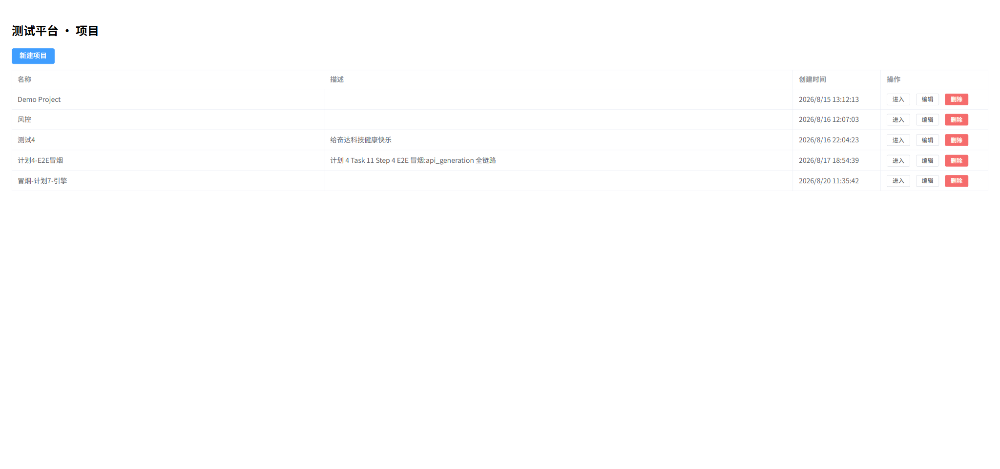
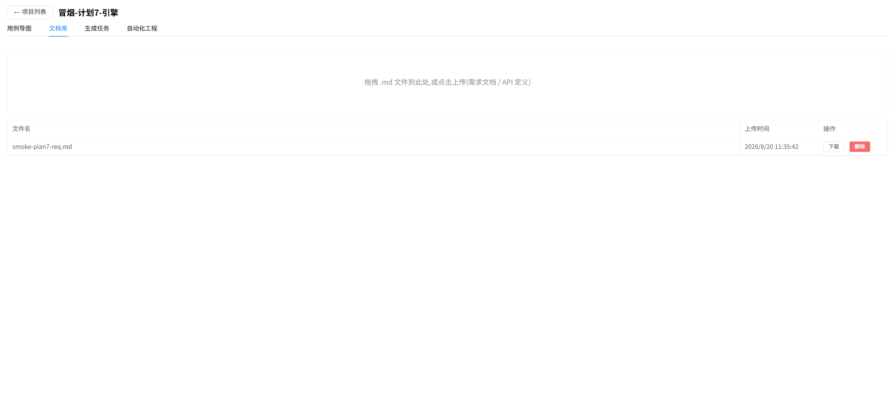
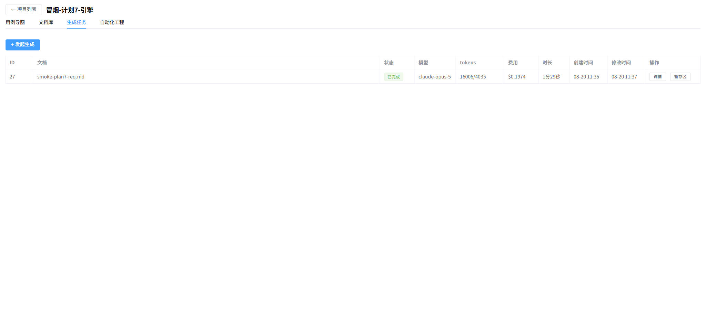
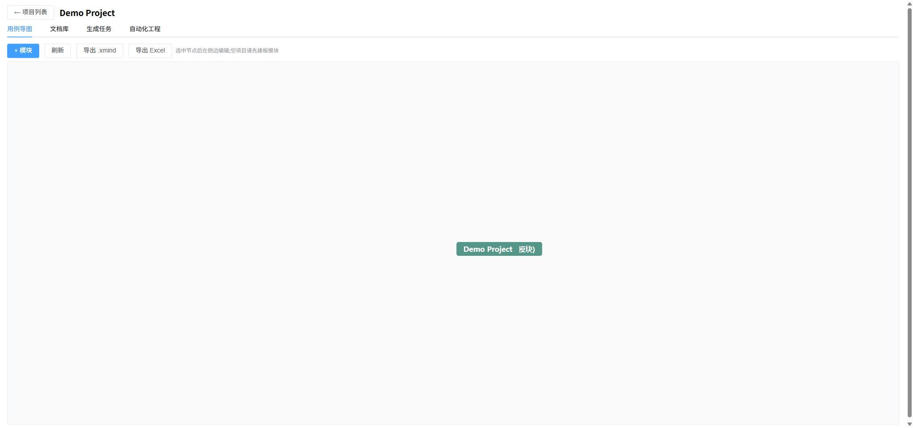

# light_tester_backend

AI 测试平台 **Light Tester** 后端:测试项目与用例树管理、两类 AI 生成任务(功能测试用例 / REST Assured 接口自动化脚本)、Web UI 自动化(Playwright 录制浏览器操作为步骤脚本,headless 执行实时预览截图流,支持断言/变量/批量执行/登录态复用)、GitLab 集成(working copy 同步、产物落仓、推送)。

生成引擎基于 **claude-agent-sdk**(Anthropic 官方 Agent SDK):以仓库内平台技能副本(`.claude/skills/`)为方法论事实源,SDK 结构化输出(`output_format` JSON Schema 终态校验)优先、叙述文本解析兜底,引擎工具调用全程记录(tool_trace)可回看。

配套前端:[light_tester_frontend](../frontend)(Vue 3 + Element Plus)。

## 功能截图

| 项目列表 | 文档库 |
|---|---|
|  |  |

| 发起生成(可选补充指令) | 生成任务列表 |
|---|---|
|  |  |

| 任务详情(思考过程 + 过程记录) | 暂存区(按功能点裁决) |
|---|---|
|  |  |

| 用例导图(树形编辑/xmind 导入导出) | 自动化工程(文件树/变更/推送) |
|---|---|
|  |  |

## 平台功能使用流程

1. **建项目**:项目 CRUD;接口自动化项目填写 GitLab 仓库地址与访问 Token。
2. **传文档**:上传 Markdown 需求文档 / API 文档,随任务引用。
3. **发起生成**:`POST /api/projects/{id}/jobs` 创建任务(case_generation / api_generation),可选 `user_prompt` 补充指令(≤2000 字,随任务持久化并注入引擎提示词);进程内 asyncio 队列消费,同项目串行、跨项目并行。
4. **引擎会话**:`app/ai/engine.py` 构建会话选项(见下「生成引擎与守卫」),把 SDK 消息流翻译为五元事件(thinking / delta / tool / usage / result)经 SSE 推给前端,同时流式落库(output_text / thinking_text / tool_trace 三列增量 flush,终态/异常均不丢)。
5. **功能用例产物**:SDK 结构化输出按平台 JSON 契约校验(功能点 → 用例 → 步骤),入暂存区等待人工裁决;裁决入库后进用例树,支持 xmind/Excel 导出。
6. **接口脚本产物**:Java 测试类全文写入自动化工程 working copy(`add_dirs` 只读挂载给引擎探索),mvn 编译校验,失败自动进入修复轮(带编译错误重开会话,最多多轮);产物变更可经平台推送 GitLab。
7. **全过程可回看**:任务详情抽屉回放思考摘要、叙述文本、过程记录(引擎每一步工具调用)、tokens 与费用(SDK `total_cost_usd` 口径)。
8. **Web UI 自动化**:弹出浏览器录制页面操作为 JSON 步骤脚本(支持断言/变量),headless 回放并经 SSE 实时推送截图流与步骤结果,登录态可采集复用让脚本免录登录步骤。

## 生成引擎与守卫

- **方法论事实源**:`.claude/skills/functional-testing/`、`.claude/skills/api-test-restassure/` 平台技能副本(输出节已改写为平台 JSON 契约);`setting_sources=["project"]` 只发现仓库级技能。
- **工具面守卫**:禁 Write/Edit/NotebookEdit/WebFetch/WebSearch(禁落盘禁外发),放行 Read/Glob/Grep/Bash,`permission_mode="dontAsk"` 未预批工具一律拒绝。
- **熔断**:`max_turns=40`、`max_budget_usd=2.0`。
- **结构化输出**:`output_format={"type":"json_schema",...}` 终态校验 + SDK 自动重试;`ResultMessage.structured_output` 直给 dict;叙述文本解析(`_strip_code_fence` + Pydantic)保留为兜底。
- **密钥**:`ANTHROPIC_API_KEY` 显式注入子进程 env,不依赖 os.environ;测试经 conftest 强制清空 key + monkeypatch `_run_query`,零子进程零网络。

## 快速开始

```bash
python -m venv .venv && source .venv/Scripts/activate   # Windows Git Bash;需 Python 3.12
pip install -r requirements.txt
cp .env.example .env   # 填 DATABASE_URL / ANTHROPIC_API_KEY
uvicorn app.main:app --port 8000
```

接口文档:http://127.0.0.1:8000/docs

Windows 下也可双击 `start.bat`(自动切到 backend 用 .venv 启动;默认不带 --reload,避免生成任务进行中因文件变动重启 worker)。

## 数据库

MySQL(SQLAlchemy 2.x)。启动时 `create_all` 建缺失表;**给已有表加列需手动执行 `scripts/*.sql`**(如 `scripts/mysql-alter-plan7.sql`),重复执行报 Duplicate column 属预期幂等行为。

## 测试

```bash
pytest -q    # 163 条;使用 DATABASE_URL 指向的测试库(默认 test_platform_test),零 AI 调用
```

## 环境变量

| 变量 | 说明 |
|------|------|
| `ANTHROPIC_API_KEY` | 必填才启动生成 worker;空则任务停留 pending |
| `AI_MODEL` | 可选,默认 `claude-opus-5` |
| `DATABASE_URL` | MySQL 连接串(见 `.env.example`) |

## 架构速览

- `app/ai/engine.py` — SDK 适配层:选项构建(守卫/技能/结构化输出固化一处)+ 会话事件流翻译(`_run_query` 为 monkeypatch seam)
- `app/ai/prompts.py` — 用户提示词构建器(动态上下文 + 补充指令 + 技能调度指令)
- `app/jobs/pipeline.py` / `app/jobs/api_gen.py` — 两类任务管道:事件消费、流式落库、暂存/写盘、修复轮(api 侧)
- `app/ui_automation/` — Web UI 自动化:交互会话基建(有头录制/采集)/录制器/执行器/DSL 纯函数层(Playwright sync API 跑后台线程,SSE 推流)
- `app/routers/` — projects/documents/jobs/modules/cases/staging/repo/ui_scripts/ui_recordings/ui_runs/ui_auth_states 等路由
- `app/models.py` / `app/schemas.py` — SQLAlchemy 模型与 pydantic 契约
