# 轻测试 LightTester

AI 测试平台(单机 Web MVP):功能用例管理(XMind 导图视图)、AI 生成功能用例与接口脚本、
Web/APP UI 自动化(录制/采集/执行)、HTTP Mock 服务、APP 性能测试、持续集成(Jenkins 执行通道)、
用户体系与项目级权限。前后端同仓(monorepo)。

| 功能                    | 入口                          | 说明                                                                                                                               |
|-------------------------|-------------------------------|------------------------------------------------------------------------------------------------------------------------------------|
| 功能用例管理            | 项目内▸功能用例管理           | XMind 导图编辑、导出 .xmind / Excel                                                                                                |
| 知识库                  | 项目内▸知识库                 | 项目文档库(需求/资料随取随用),实际是通过rag知识库的mcp提供给测试Agent调用                                                          |
| AI 生成任务（展示思路） | 项目内▸AI测试▸生成任务        | PRD/文档 → AI 生成功能用例(依赖skill、项目文档数据/rag知识库、聊天框提示，来生成功能用例) → 暂存区裁决入树                         |
| 自动化工程              | 项目内▸AI测试▸自动化工程      | AI 生成接口自动化脚本(依赖skill、项目文档数据/rag知识库、聊天框提示(比如多接口，如何串接口、接口的入参出参示例)) + Git 仓库推送    
| 多端 UI 自动化          | 项目内▸AI测试▸多端 UI 自动化  | 实验性(Web/Android/鸿蒙 AI 执行闭环)                                                                                               |
| Web 自动化              | 项目内▸UI自动化▸Web自动化     | Playwright 录制 → DSL → 回放执行,可导出 pytest+playwright 脚本                                                                     |
| APP 自动化              | 项目内▸UI自动化▸APP自动化     | SoloPi 采集/回放(Android)，可导出appium脚本                                                                                        |
| HTTP Mock               | 项目内▸接口Mock▸HTTP Mock     | 每项目多实例 mock server,规则匹配 + 模板响应,若未匹配到规则，则透传原始请求，返回对应接口真实响应数据。<br/>有mock匹配记录，方便排查问题 |
| APP 性能测试            | 项目内▸性能测试▸APP性能测试   | SoloPi执行性能测试，平台采集数据进行展示                                                                                           |
| 持续集成                | 项目内▸持续集成▸执行计划/执行记录 | 自动化用例接入 Jenkins 执行:计划选择集合快照、新鲜度检测、自动建参数化流水线、实时日志与 JUnit 报告                              |
| 用户与权限              | 顶栏▸用户管理                 | JWT 登录,owner/editor/viewer 项目级角色                                                                                            |

> 以下截图均来自真实运行环境(测试数据)。

## 登录与用户体系

后端首次启动自动引导管理员账号 **admin / admin123**。所有数据按项目隔离,未登录重定向到登录页;
顶栏可切换项目,右上角进入「用户管理」(仅管理员)。

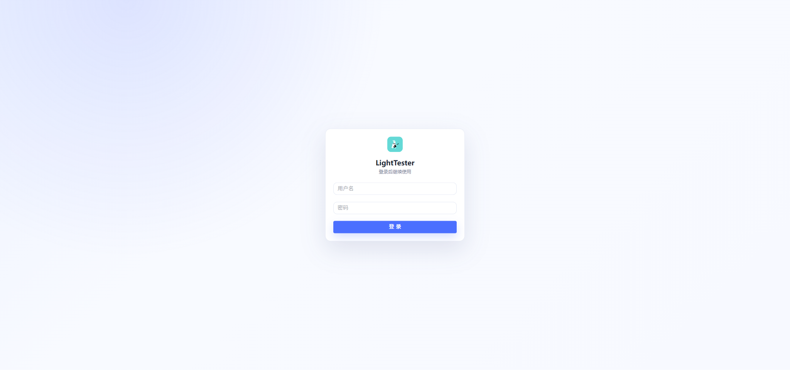

- **用户管理**:新建/停用用户、重置密码;管理员可将用户授权为某项目的 owner / editor / viewer
  (owner 可管理成员与删除项目,editor 可读写业务数据,viewer 只读)。
- 项目内右上角「成员」按钮可查看/管理当前项目成员。

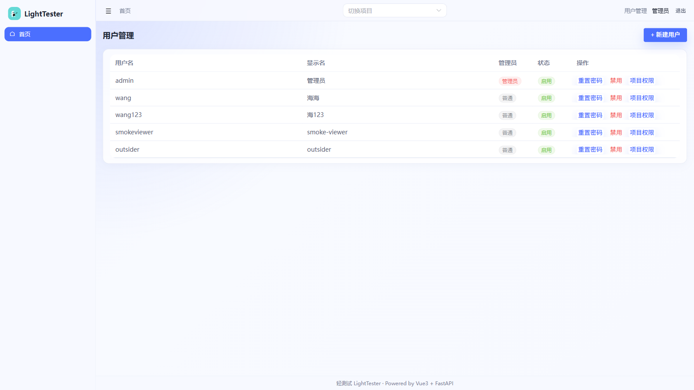

## 首页

项目卡片墙:新建项目、进入项目、编辑/删除。所有业务功能都挂在项目下(先建项目再干活)。

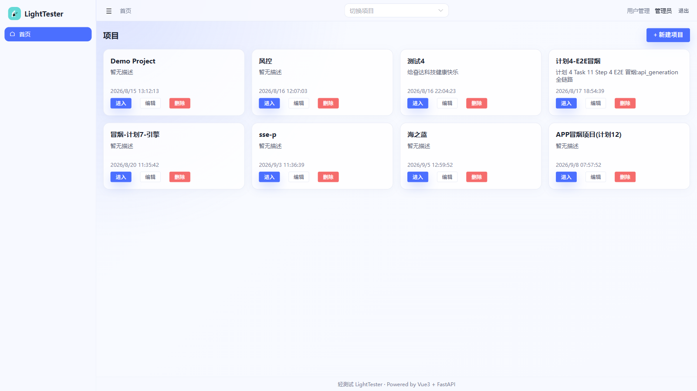

## 功能用例管理

以「模块 → 功能点 → 用例」三级树组织用例,XMind 导图视图直接编辑:

- **建树**:「+ 模块」添加模块,选中节点后在右侧编辑区添加子节点/用例(支持优先级 P0-P3);
- **AI 生成**:配合「AI测试▸生成任务」把生成的用例从暂存区裁决入树(见下节);
- **导出**:一键导出 `.xmind`(可直接用 XMind 打开)与 Excel(测试交付件格式)。

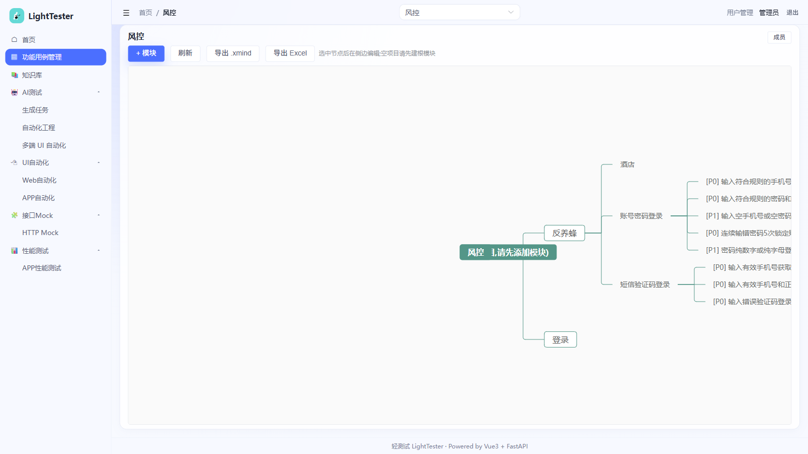

## 知识库

项目级文档库:上传/维护需求文档、参考资料,供团队查阅。文档内容也可作为 AI 生成任务的输入素材。

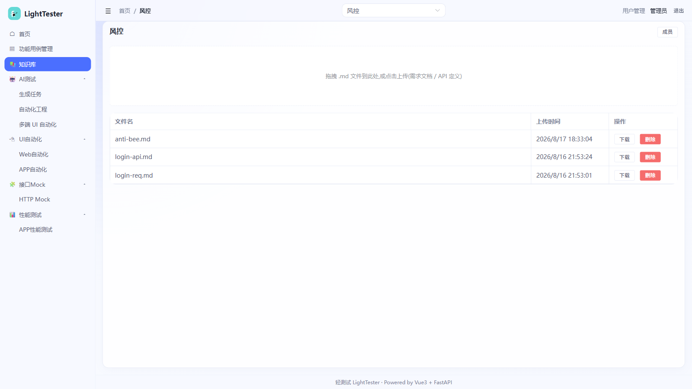

## AI 测试 ▸ 生成任务

把需求文档变成功能用例:上传 PRD/需求片段 → 创建生成任务 → AI 按项目用例树结构产出用例:

- 任务执行全程 **SSE 实时回放**(模型输出流式可见),完成后落「暂存区」;
- **暂存区逐条裁决**:通过 → 入用例树,拒绝 → 丢弃,可多次生成多次裁决;
- 任务可回看:输入/输出全文、耗时、tokens 消耗、「详情」抽屉含思考摘要。

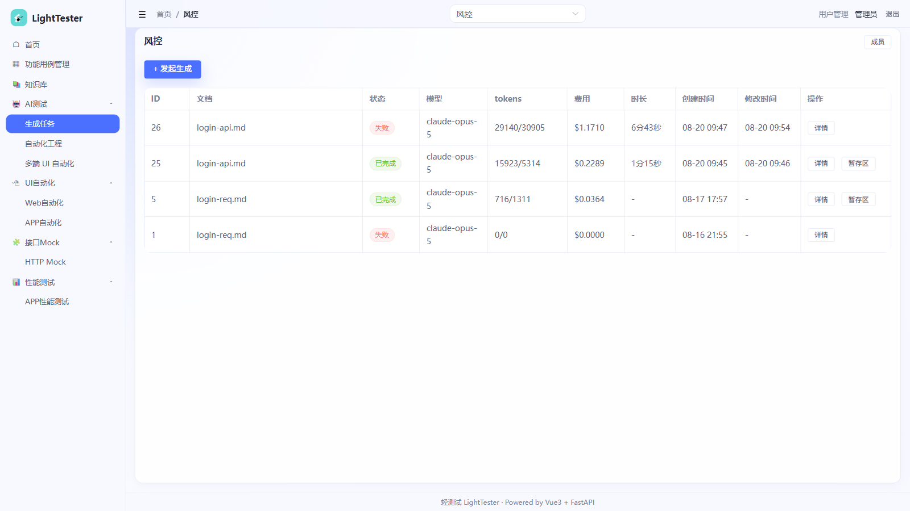

## AI 测试 ▸ 自动化工程

AI 生成接口自动化脚本(pytest),工程关联 Git 仓库,生成结果可一键推送到远端分支:

- 每项目按 kind(api/web/app)各一个自动化仓库,生成的脚本文件用内置 Monaco 编辑器直接改;
- 推送走后端配置的 Git 凭据,推送历史可追溯。

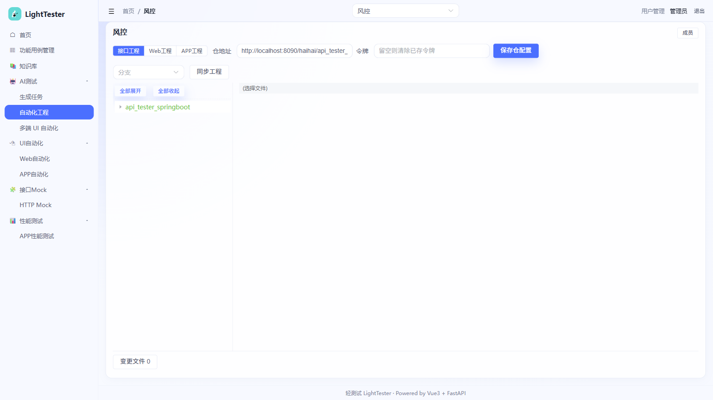

## AI 测试 ▸ 多端 UI 自动化(实验性)

> ⚠️ 该功能为实验性方向(当前迭代暂停演进),界面可用,能力以 Web 端 AI 执行闭环为主。

Web / Android / 鸿蒙三端脚本与执行历史:新建脚本 → AI 按步骤执行(ai 系动作)→ 记录通过/总步数。
已有历史可回看每步执行结果。

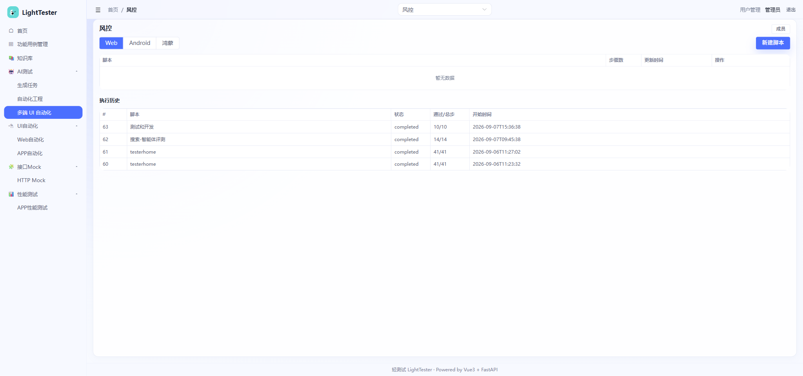

## UI 自动化 ▸ Web 自动化

浏览器自动化一条龙:**录制 → 生成 DSL 脚本 → headless 回放**,全程无需写代码:

- **录制**:内置 Playwright 录制器,边点边录,自动生成 DSL 步骤;
- **登录态复用**:录制时登录一次,回放免登录;
- **执行**:headless 运行,步骤事件与页面截图边跑边出(实时预览);
- **导出**:脚本可导出为 Python + pytest(Playwright)工程,脱离平台独立运行。

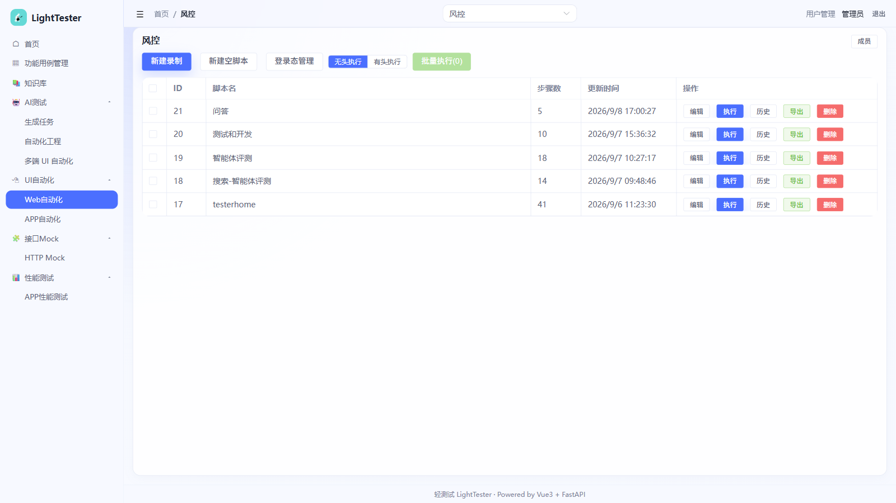

## UI 自动化 ▸ APP 自动化

基于 SoloPi(Solo Automator)的 Android 自动化,设备端开启 SoloPi 无障碍后即可使用:

- **导入用例**:从设备端 SoloPi 采集的用例一键同步入平台;也可新建空白用例;
- **脚本管理**:编辑步骤、查看被检测应用与步骤数、导出;
- **执行**:单脚本回放或批量执行,执行历史带「平台状态 + 端上终态」双回执,详情逐步可查;
- 配合「APP 性能测试」:执行时自动采集性能数据,形成 APP 测试闭环。

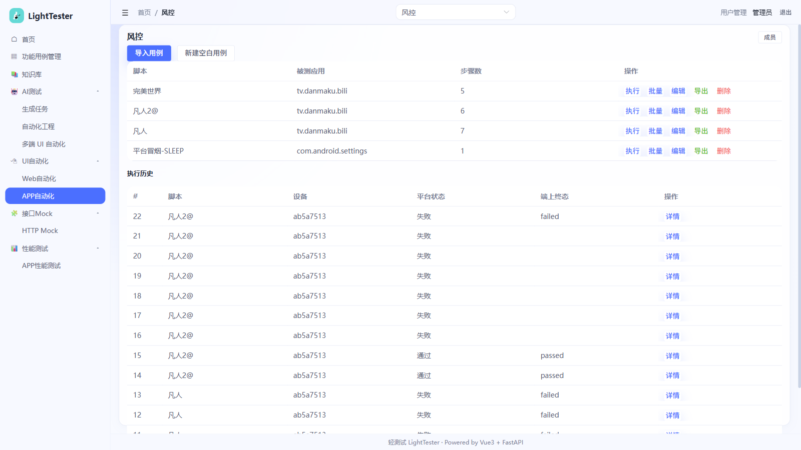

## 接口 Mock ▸ HTTP Mock

企业级 mock server:**每个项目可建多个 Mock 实例**(独立进程、独立端口,启停可控、异常自愈):

1. **新建实例**:命名 + 指定端口(留空自动分配),可选开启 CORS、配置默认兜底响应;拿到 `http://localhost:<端口>` 即可指向被测系统;
2. **规则组与规则**:规则按「方法 + 路径」组织为**规则组**(如 `GET /v1/forecast`),组内放该接口的条件变体:
   - 路径模板只填**纯路径**(动态段用 `{var}`),查询参数放匹配条件里;
   - 匹配条件三作用域:**查询参数 / 请求头 / 请求体**——请求体的参数名填 **JSONPath**(如 `$.user.id`,
     支持数组下标 `$.data.list[0].id`),匹配方式 eq(相等)/ regex(正则,如 `^admin` 即前缀匹配);
   - 匹配顺序 = 组间序 → 组内序,取**第一条命中**;组与规则均可启停,规则支持**一键复制**派生变体;
   - 响应体支持 **Jinja2 模板**(`{{ path.id }}`、`{{ uuid4() }}` 等),可配延迟(ms)与模拟超时;
3. **透传(组级开关)**:组内规则全不中时,请求原样转发到该组配置的**真实上游接口**,真实响应直接返回给被测系统(上游 5xx 也照透);转发不通才回实例默认响应——mock 不只说谎,还能演练"上游超时/故障"场景;
4. **看命中**:每次请求落命中记录(完整出入参、结局三态:命中 / 兜底 / 透传,1000 条滚动),支持按规则组筛选与「命中 / 未命中 / 透传」四态过滤;从规则组点「命中记录详情」一键直达该组的命中视角。

上例:实例「天气查询」(9001) 的规则组 `GET /v1/forecast` 配条件 `$.latitude` 等,即可对天气接口做确定性模拟;
该组若开启透传并指向真实天气服务,把组内规则全部停用,被测系统拿到的就是真实天气——用来对比 mock 与真实表现的差异。

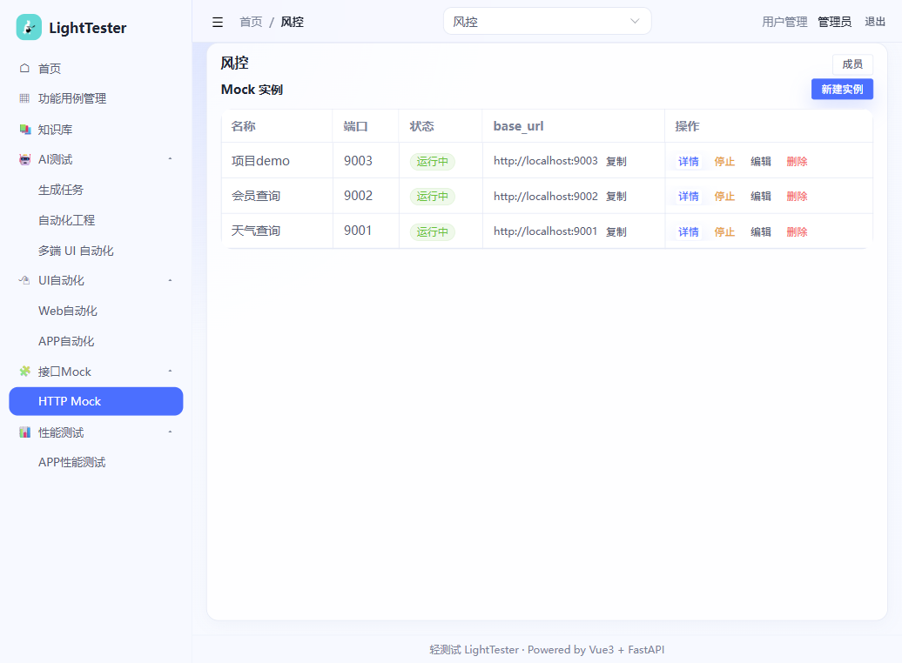

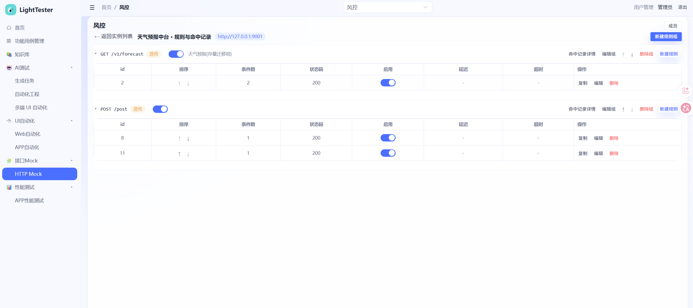

## 性能测试 ▸ APP 性能测试

统一性能记录与展示视图(数据来自 APP 自动化采集或设备历史导入):

- **记录列表**:名称/来源(采集、导入)/脚本/设备/采集项/数据完整性,「详情」抽屉看逐项曲线;
- **跨记录对比**:勾选多条记录 → 叠加曲线 + 统计表(mean/p90 并列),支持导出长图/单图;
- **趋势**:按脚本/设备筛选,单指标多批次走势(mean 实线 + p90 虚线),直观看性能劣化;
- **设备历史导入**:发现设备上的历史采集数据,一键导入为性能记录(重复导入自动去重)。

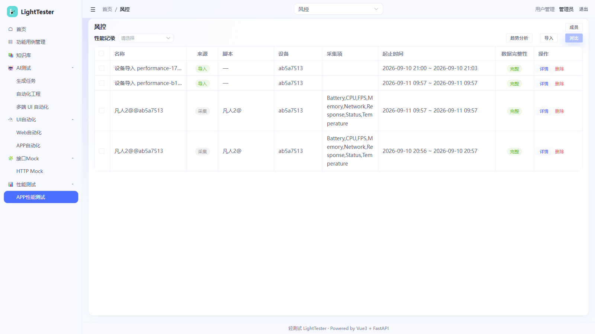

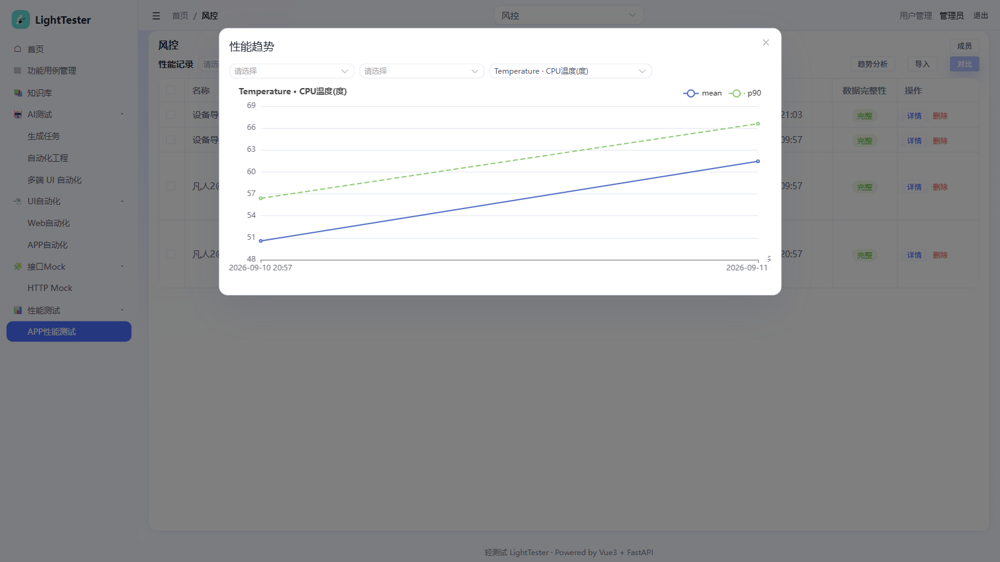

## 持续集成 ▸ 执行计划与执行记录

把自动化用例接入 Jenkins 执行通道(平台编排,Jenkins 只管跑):

- **执行计划**:单类型(ui/api)计划绑定分支,两类用例均为「先扫描再勾选」的注册表模式(仓是唯一事实源):
  接口扫 Java 测试方法(仓×分支×类×方法,TestNG/JUnit),UI 扫 pytest 用例函数(仓×分支×文件×函数,
  标题取 docstring、标记只读展示);勾选提交 nodeid(`文件::函数`)精确到用例;触发前自动同步仓库分支,
  并做**新鲜度检测**——本地有未提交/未推送代码时提示确认,可选择按远端现状(老代码)继续;
- **自动建 Job**:平台按需在 Jenkins 创建常驻参数化流水线(`light_tester_p{项目}_{类型}`,
  双 docker agent:接口=maven+JDK8、UI=Playwright),`buildWithParameters` 传入仓地址/分支/用例集合触发;
  UI 容器按需安装钉版 playwright(与镜像浏览器配套)及工程 `vendor/*.whl` 自包含依赖;
- **执行记录**:纯出站轮询(~2s)拉构建状态与 console 增量;详情页**实时直播日志**,
  用例树按「类 → 方法」分组(数据驱动重名自动合并),点用例在日志中**定位高亮**,另有全量日志弹窗;支持停止/重跑;
- **报告**:JUnit XML 一统(pytest/surefire 兼容),逐用例结果入平台,数据驱动子用例逐行呈现。

前置:管理员在「用户管理」页底部配置 Jenkins 连接(base_url + API token);Jenkins 侧配好
GitLab 凭据与 docker 环境(流水线自动拉起 alpine/git、maven、playwright 镜像)。

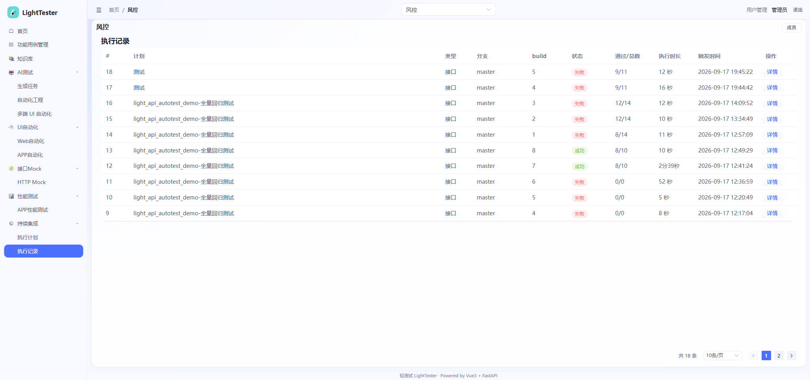

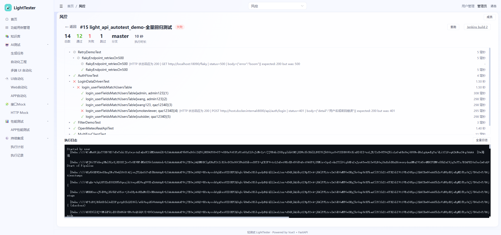

## 快速开始

```bash
# 后端(需 MySQL;启动时自动建表并引导 admin/admin123)
cd backend
py -3.12 -m venv .venv && source .venv/Scripts/activate   # Windows Git Bash
pip install -r requirements.txt
uvicorn app.main:app --port 8000                           # 接口文档 http://127.0.0.1:8000/docs

# 前端
cd frontend
npm install                                                # 国内可加 --registry=https://registry.npmmirror.com
npm run dev                                                # http://localhost:5173(代理 /api → 8000)
```

## 目录结构

| 目录 | 内容 | 技术栈 |
|---|---|---|
| [`backend/`](backend/) | FastAPI 服务(用例树/文档库/AI 生成任务管道+Agent SDK 引擎/Web·APP UI 自动化/HTTP Mock 服务/性能记录/持续集成·Jenkins 触发与轮询/用户权限)、平台技能副本 `.claude/skills/` | Python 3.12 · FastAPI · SQLAlchemy · MySQL · claude-agent-sdk · Playwright · jsonpath-ng · Jinja2 |
| [`frontend/`](frontend/) | Vue3 单页应用(导图编辑器/任务抽屉/Monaco/Web·APP 自动化/Mock 管理台/性能图表/用户管理) | Vue3 · TypeScript · Element Plus · simple-mind-map · Monaco · echarts |

各自的详细说明见 [`backend/README.md`](backend/README.md) 与 [`frontend/README.md`](frontend/README.md);
更深入的资料:[`docs/architecture.md`](docs/architecture.md)(架构与数据流)、
[`docs/api.md`](docs/api.md)(API 参考)、[`docs/adr/`](docs/adr/)(架构决策)。

> 本仓库由原 `light_tester_backend` / `light_tester_frontend` 两仓合并而来(git subtree,完整提交历史保留);
> 旧两仓已归档。
